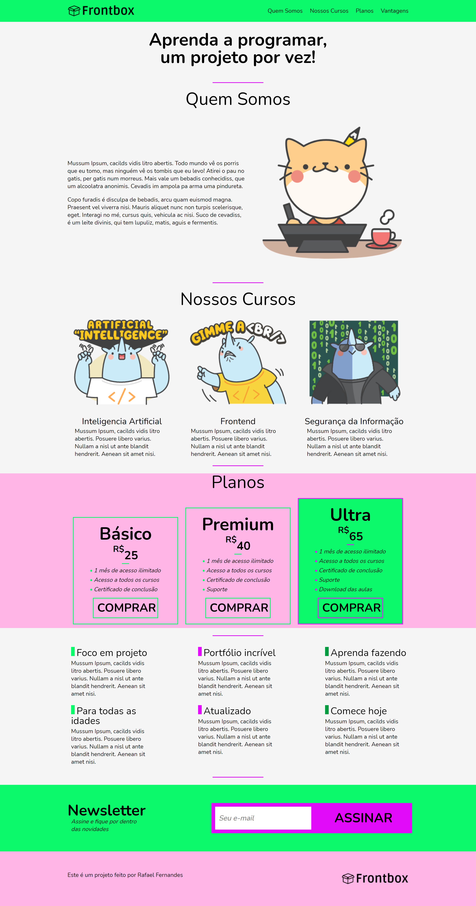

# ✨Projeto Site Frontbox

## Introdução

Nesse projeto, foi desenvolvido um site responsivo usando Flexbox

O que eu aprendi nesse projeto:

* Flexbox
* Box Sizing
* Variáveis CSS
* Media Queries
* Tecnologias utilizadas (HTML, CSS Flexbox)
* Alterações no projeto original com efeitos de transição
* Link abaixo Projeto Frontbox  (https://app.netlify.com/sites/frontboxx)     
